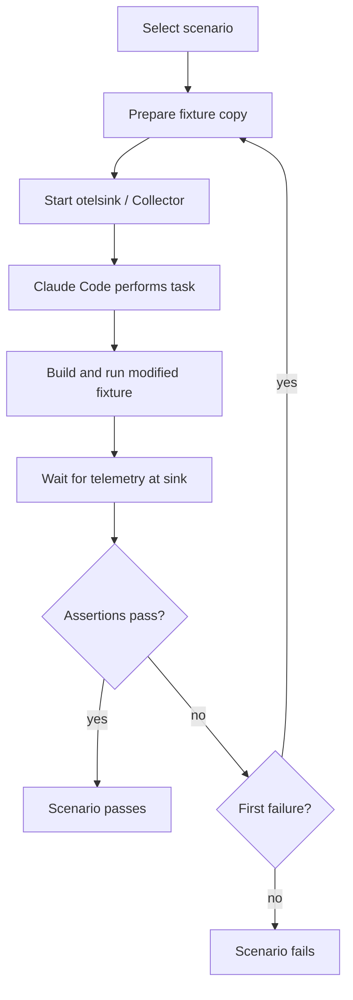

# Skill evals in CI — requirements

## Summary

Add a CI eval harness in which Claude Code, running headless, performs realistic tasks against fixture apps for all 4 skills, and a Go harness verifies deterministically that the resulting telemetry flows and is correct.
The full scenario matrix — including Kubernetes scenarios on kind — exists from day one; PRs run only the scenarios affected by their changes, and the full matrix runs nightly and gates releases.
A second deterministic layer extracts and validates every fenced code and config example in the skills.

---

## Problem frame

The skills in this repository are consumed operationally by coding agents, but CI today only checks structure, broken links, and commit message format.
Nothing validates that an agent following the skills produces working telemetry.

Real failures have already been found — by humans testing manually.
`TODO.md` records several: `OTEL_LOGS_EXPORTER=otlp` silently doing nothing in Go because the slog bridge is undocumented, the .NET install path being a dead end on Apple Silicon, and the missing `Activity.Current` enrichment pattern.
Each of these shipped, reached a user, and cost a manual debugging session to diagnose.
As the skill matrix grows (10 SDKs, Kubernetes platforms, 4 Collector deployment paths), manual testing cannot keep pace, and regressions from skill edits currently have no gate at all.

---

## Key decisions

- **End-to-end effectiveness is the primary signal.**
  The evals exist chiefly to prove that an agent given a skill and a realistic task produces working results.
  Content correctness, guidance-following quality, and regression protection are secondary signals, covered by the example-validation layer and the gating semantics rather than by dedicated eval suites.
- **Claude Code headless is the sole agent under test, on a harness-agnostic scenario format.**
  This accepts a vendor-diversity risk (a skill could work for Claude Code but confuse another agent) in exchange for one well-understood harness and one API secret.
  Scenarios are defined as task prompt plus fixture plus assertions so other agent CLIs can be added as runners later without rewriting scenarios.
- **Verification is deterministic, not LLM-judged.**
  The ground truth for this domain is machine-checkable: telemetry either arrives at an OTLP endpoint with the expected shape or it does not.
  The gate never depends on an LLM judge.
- **The harness is a Go test suite reusing `testutil` and `otelsink` from [opentelemetry-packaging](https://github.com/open-telemetry/opentelemetry-packaging/tree/main/testutil).**
  `otelsink` is an in-process OTLP receiver (gRPC and HTTP) that writes received traces, metrics, and logs to JSONL with query and wait helpers; `testutil` manages Docker container lifecycle.
  This avoids owning an eval framework and plays to existing OpenTelemetry expertise.
- **Full matrix from day one, including Kubernetes.**
  All 4 skills, all 10 SDK rule files, the Kubernetes platform rules, and all 4 Collector deployment paths are covered before the work is considered done.
  Kubernetes scenarios run on real kind clusters, including operator and Helm installs, accepting the heavier and flakier CI jobs this implies.
- **Selective on PR, full nightly.**
  PRs run only the eval cases mapped to the changed skill files and block on failure; the full matrix runs nightly and on release.
  This keeps PR feedback fast while nothing escapes uneval'd.
- **Judged Q&A prose evals are deferred.**
  Guidance-following quality is covered indirectly through end-to-end failures; a judged Q&A suite is added only if a real prose gap slips past the e2e layer.

---

## Requirements

**Coverage**

- R1. Every skill has end-to-end eval scenarios in which the agent under test performs a realistic task with the skill loaded: instrument an application (`otel-instrumentation`), author or modify a Collector configuration (`otel-collector`), write transformation statements (`otel-ottl`), and apply attribute naming (`otel-semantic-conventions`).
- R2. The day-one matrix covers every SDK rule file (10 languages), the Kubernetes platform rules, all 4 Collector deployment rule files, OTTL, and semantic conventions.
- R3. Kubernetes scenarios execute against a real cluster (kind) in CI, including OpenTelemetry operator, Helm chart, raw manifest, and Dash0 operator deployment paths.
- R4. The failures recorded in `TODO.md` (Go slog bridge, .NET Apple Silicon install path, `Activity.Current` enrichment) are encoded as day-one scenarios.

**Harness and verification**

- R5. The agent under test is Claude Code in headless mode, loading the skill the same way a real consumer does.
- R6. Scenarios are defined in a harness-agnostic format — task prompt, fixture, assertions — so additional agent CLIs can run the same scenarios later.
- R7. Pass or fail is decided by deterministic assertions on telemetry received over OTLP: expected signals present, resource attributes correct, and expected span, metric, and log content.
- R8. The harness is written in Go and reuses `testutil` and `otelsink` from the `opentelemetry-packaging` repository.
- R9. Fixture applications live in this repository, one per SDK rule file, minimal but representative of a real service (at least one inbound endpoint and one outbound dependency call).

**Example validation**

- R10. Every fenced code and configuration block in skill and rule files is extracted and validated deterministically by type: code samples compile, Collector configurations pass validation, OTTL statements parse, and YAML is well-formed.

**CI integration and gating**

- R11. Pull requests run only the scenarios mapped to the changed skill files; a failing scenario blocks merge.
- R12. The full matrix runs nightly and on release; a nightly failure produces a visible report, and a release failure blocks the release.
- R13. A failing scenario is retried once automatically; 2 consecutive failures fail the check.

---

## Actors

- A1. Skill maintainer — edits skill content, opens PRs, responds to eval failures.
- A2. Eval harness — Go test suite that orchestrates fixtures, the agent under test, and assertions.
- A3. Agent under test — Claude Code headless, performing the scenario task with the skill loaded.
- A4. CI — GitHub Actions workflows that select scenarios, run the harness, and enforce gates.

---

## Key flows

- F1. Scenario execution
  - **Trigger:** CI (A4) invokes the harness (A2) for a selected scenario.
  - **Steps:** The harness prepares a clean copy of the fixture; starts `otelsink` (and any scenario-required Collector); invokes Claude Code (A3) with the task prompt and the skill; builds and runs the modified fixture pointed at the sink; waits for telemetry; runs the deterministic assertions.
  - **Outcome:** A pass or fail verdict with the received telemetry attached as evidence.
  - **Covers R1, R5, R7.**

- F2. Pull request check
  - **Trigger:** A PR touches files under `skills/`.
  - **Steps:** CI maps changed files to scenarios; runs the affected scenarios (F1) plus example validation on changed files; applies the retry-once policy.
  - **Outcome:** Merge is blocked until affected scenarios and example validation pass.
  - **Covers R10, R11, R13.**

- F3. Nightly and release run
  - **Trigger:** Schedule, or a release being cut.
  - **Steps:** CI runs the full matrix (F1 for every scenario, including Kubernetes jobs) and full example validation.
  - **Outcome:** Nightly failures produce a visible report for the maintainer; release failures block the release.
  - **Covers R2, R3, R12.**

---

## Acceptance examples

- AE1. **Covers R13.**
  **Given** a scenario fails on its first run, **when** the automatic retry passes, **then** the check is green and the flake is recorded in the run output.
- AE2. **Covers R11.**
  **Given** a PR changes only `skills/otel-instrumentation/rules/sdks/go.md`, **when** CI selects scenarios, **then** only Go instrumentation scenarios run and unrelated scenarios (for example PHP or Collector deployment) do not.
- AE3. **Covers R10.**
  **Given** a rule file contains a fenced Collector configuration that fails validation, **when** the example-validation job runs, **then** the PR check fails and names the file and block.
- AE4. **Covers R7.**
  **Given** the agent completes a scenario task but the emitted telemetry lacks the expected `service.name`, **when** assertions run, **then** the scenario fails even though the agent reported success.
- AE5. **Covers R12.**
  **Given** a nightly run fails a scenario no recent PR touched, **when** the run completes, **then** a report is raised that identifies the scenario and links the failing run.

---

## Success criteria

- Each `TODO.md` failure, replayed against the skill content as it was before the corresponding fix, causes its scenario to fail; against the fixed content, it passes.
- A deliberately corrupted skill edit (for example, a wrong environment variable name in an SDK rule) fails the affected PR-selective run.
- PR-selective eval feedback completes within a PR-review-friendly wall-clock time; the exact bound is set during planning.

---

## Scope boundaries

- Judged Q&A evals of skill prose — deferred until a real gap demonstrably slips past the end-to-end layer.
- Additional agent CLIs (Codex, Gemini) as runners — deferred; the scenario format keeps the door open (R6).
- Quality scoring or metrics beyond pass and fail — out of scope; regression protection is a gate, not a scoreboard.

---

## Dependencies and assumptions

- `testutil` and `otelsink` from `opentelemetry-packaging` are reusable outside that repository; the consumption mechanism (module import or vendoring) is settled during planning.
- CI has an Anthropic API key available as a repository secret, and recurring API spend for the nightly full matrix (order of tens of dollars per night) is accepted without a hard budget cap.
- GitHub-hosted runners support the Docker and kind workloads the scenarios require; runner sizing is settled during planning.
- Fixture applications become a maintained codebase in their own right — likely larger than the skills themselves — and their upkeep is accepted as part of this repository's carrying cost.

---

## Outstanding questions

**Deferred to planning**

- The concrete scenario inventory per rule file, and the mapping from changed paths to scenarios.
- How nightly failure reports are delivered (GitHub issue, Slack, or both).
- Whether `otel-semantic-conventions` scenarios need dedicated fixtures or piggyback on instrumentation scenarios with attribute-focused assertions.
- Wall-clock budget for PR-selective runs, and job parallelism to meet it.
- Whether example validation runs as part of the existing lint job or as a separate workflow.
