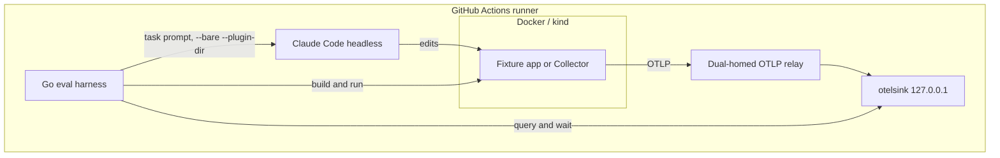
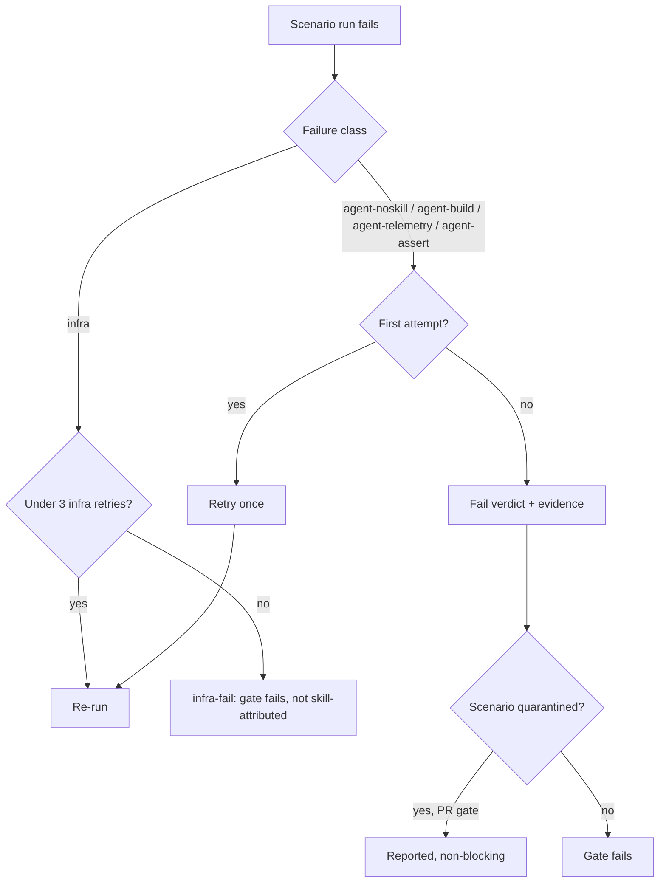
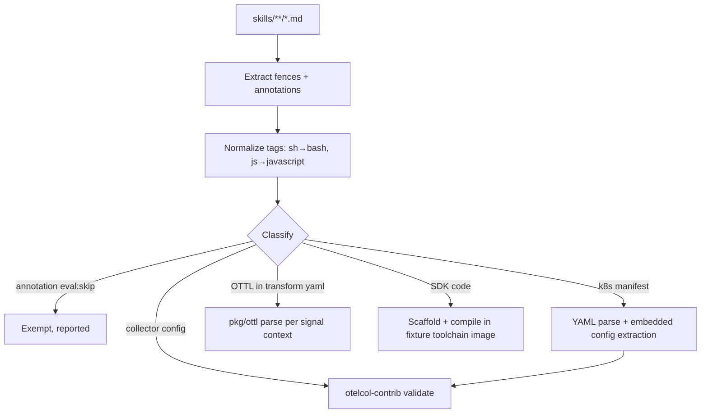

# feat: CI eval harness for agent skills

## Summary

Add a Go eval harness (the first code in this repository) in which Claude Code, running headless, performs realistic tasks against fixture apps for all 4 skills, and deterministic assertions on telemetry received over OTLP decide pass or fail.
The full scenario matrix — 10 SDKs, Collector pipelines, OTTL, semantic conventions, and Kubernetes scenarios on kind — is covered, plus a deterministic validation layer for every non-exempt fenced example in the skills.
New GitHub Actions workflows run affected scenarios on PRs, the full matrix nightly, and gate releases.

---

## Problem frame

CI today checks structure, broken links, and commit format — nothing validates that an agent following the skills produces working telemetry.
Real failures (recorded in `TODO.md`) were found by humans testing manually and cost debugging sessions downstream.
The origin document (see origin: `docs/brainstorms/2026-07-17-skill-evals-ci-requirements.md`) fixes the scope: end-to-end effectiveness is the primary signal, verification is deterministic, and the matrix is full from day one.

---

## Requirements

Origin requirements R1–R13 are carried forward unchanged; the groups below restate them for traceability.
R14–R21 are plan-added requirements from research and flow analysis.

**Carried from origin**

- R1–R4. Coverage: end-to-end scenarios for every skill, the full rule-file matrix (10 SDKs, Kubernetes platform, 4 Collector deployment paths, OTTL, semconv), Kubernetes scenarios on a real kind cluster, and the `TODO.md` failures encoded as day-one scenarios.
- R5–R9. Harness: Claude Code headless as the agent under test, harness-agnostic scenario format, deterministic OTLP assertions, Go harness reusing `testutil`/`otelsink` from `opentelemetry-packaging`, fixture apps in-repo.
- R10. Example validation: every fenced code and configuration block extracted and validated deterministically by type.
- R11–R13. Gating: path-selective PR runs that block merge, nightly and release full-matrix runs, retry-once-then-fail.
  PR-selective runs complete within 15 minutes on `ubuntu-latest` for SDK-scoped diffs, and within 30 minutes when shared-file changes fan out to a near-full matrix.

**Plan-added: security and gating**

- R14. Agent scenarios run only where secrets are legitimately available: same-repo PRs run normally; fork and Dependabot PRs require maintainer approval through a GitHub Actions environment before agent scenarios run.
  The Anthropic API key exists only as an environment-scoped secret on those environments, never as a repository-level secret.
  Deterministic layers (example validation, fixture builds) need no secrets, never reference the key, and run on all PRs.
- R15. Every scenario verdict carries a failure class; infrastructure failures (API overload, CLI crash, harness or cluster error) retry up to 3 attempts without counting toward the verdict and then fail as a terminal `infra-fail`, and agent-attributable failures (skill not invoked, output does not build, no telemetry, assertions fail) follow the retry-once policy of R13.
- R16. A quarantine list excludes named scenarios from the PR gate while nightly runs continue to execute and report them.
- R21. Fixture workloads run egress-restricted at runtime: build steps may reach package registries, but a running fixture can reach only the sink or relay, so telemetry cannot leak to real backends and injected fixture code cannot exfiltrate data.

**Plan-added: integrity and cost**

- R17. Scenario selection is self-enforcing: CI fails if any rule file maps to zero scenarios or any mapping references a nonexistent file.
- R18. Per-scenario cost controls exist: a turn cap, a wall-clock timeout, cancellation of superseded PR runs, and per-run cost recorded from the CLI's JSON output.
- R19. The Claude Code CLI version and the model ID are pinned in the repository and changed only through PRs, which run the full matrix.
- R20. Published artifacts (Tessl tile, Claude/Cursor plugins, Gemini extension) exclude the eval harness and fixtures.

---

## Key technical decisions

- **New Go module at `evals/`, Go ≥ 1.26.3, `opentelemetry-packaging` pinned at `v0.0.2`.**
  The `testutil`/`otelsink` packages are importable from the Go proxy — no vendoring.
  The v0.0.x pre-release API demands a strict pin; the Go toolchain floor comes from that module's `go.mod`.
- **Skills load through `claude -p --bare --plugin-dir <repo-root>` using the existing `.claude-plugin/plugin.json`.**
  `--bare` disables all auto-discovery, so the run is hermetic; the `system/init` event in `--output-format stream-json` reports `plugin_errors`, giving a machine-checkable "skill actually loaded" gate before any scenario work starts.
  Skills are addressed in prompts by their namespaced name (`dash0-agent-skills:<skill>`).
  `plugin_errors` proves the skill loaded, not that it was used: the verdict also requires transcript evidence the skill entered context — a Skill tool-use event for the target skill or a file read inside the skill's directory — failing with class `agent-noskill` when neither appears, and a corrupted-skill canary verifies the gate detects regressions (see U3).
- **Verdicts come from `otelsink` queries only.**
  Each scenario gets its own in-process sink on ephemeral ports; isolation between concurrent scenarios rides on the sink's per-test `test.id` resource attribute.
  No LLM judge participates in pass or fail.
- **Telemetry bridge: a harness-owned OTLP relay, built in U1, is the universal container-to-sink path.**
  `otelsink` hardcodes `127.0.0.1`, which neither kind pods nor fixtures on a restricted Docker network can reach; the relay is a dual-homed container — attached to the internal fixture network to receive OTLP, and to a normal bridge network with host-gateway access to forward to the loopback `otelsink` — answering CORS preflights for the browser fixture, and requiring the per-run bearer token on paths that reach it outside the internal network (kind).
  In-cluster Collectors (themselves the subject of the deployment scenarios) export to the same relay; a spike validates kind-to-relay reachability on a GitHub runner before any Kubernetes scenario is built (see U6).
- **Failure taxonomy with per-class retry.**
  Classes: `infra` (Anthropic API 429/529, CLI crash, sink/cluster/harness error — retried up to 3 attempts without counting, then a terminal `infra-fail` that fails the gate with a non-skill-attributable message and stays out of the skill-failure issues), `agent-noskill` (transcript shows neither a Skill invocation nor a file read inside the target skill's directory), `agent-build` (agent output does not build), `agent-telemetry` (builds, no telemetry before timeout), `agent-assert` (telemetry arrives, assertions fail); each agent-attributable class is retried once per R13/R15.
  The verdict attaches the agent transcript and received-telemetry JSONL as evidence.
- **Declarative scenario registry with explicit rule-file classification.**
  Every rule file carries exactly one classification: `dedicated` — edits select the scenarios that declare it (the 10 SDK files, `platforms/k8s.md`, the 4 `deployment/` files, `pipelines.md`, `redaction.md`, `enrichment.md`, `attributes.md`); `shared` — edits select all scenarios of the skill (the instrumentation cross-cutting files, the remaining Collector, OTTL, and semconv rule files); or `exempt` with a recorded reason (none initially).
  `SKILL.md` selects all scenarios of its skill; fixture paths select the scenarios using them; `evals/harness/**` and `evals/cmd/**` select one smoke scenario per skill; changes to `.claude-plugin/`, `CLAUDE.md`, or pinned versions select the full matrix.
  A registry test enforces R17: every rule file classified, every mapping target existing.
- **Example validation pins `otelcol-contrib` and `pkg/ottl` to the same version (`v0.156.0`).**
  Collector YAML validates via `otelcol-contrib validate`; OTTL statements (which appear only inside `transform`/`filter` processor YAML today) are extracted and parsed via `pkg/ottl` against the correct signal context; the shared pin prevents validator drift.
  Exemptions use an HTML-comment annotation directly above the fence; the extractor ships a dry-run report mode to calibrate the convention against the current 447 blocks before enforcement.
- **Compile validation of SDK code blocks reuses the fixture toolchain containers.**
  Each language's fixture (U3/U4) supplies a container image with a pinned OTel dependency set; the example validator wraps compilable blocks in per-language scaffolds inside those images, so compile checks arrive language-by-language with the fixtures.
- **CI topology: dedicated eval workflows plus one stable, fail-closed aggregate gate job.**
  Branch protection requires a single job name (`evals-gate`) that aggregates dynamic per-scenario jobs; fork runs go through a `fork-evals` environment with required reviewers (R14).
  The gate fails closed: `evals-pr.yml` has no workflow-level path filter (selection happens inside via `select-scenarios`), and `evals-gate` runs with `if: always()`, failing unless every needed job succeeded or was deliberately deselected — a skipped check can never satisfy branch protection.
- **Releases pin one SHA end-to-end.**
  `release.yml` resolves HEAD once at dispatch; the eval matrix and `tessl tile publish` both run against that SHA, so the workflow's own version-bump commits (which never touch `skills/`) are outside the evaluated range.

---

## High-level technical design

Component topology — who talks to whom during one scenario:



Verdict flow — how a raw failure becomes a gate decision:



Example-validation pipeline — from markdown to validators:



---

## Output structure

```text
evals/
  go.mod                      # module; Go >= 1.26.3; pins opentelemetry-packaging v0.0.2
  versions.env                # pinned Claude Code CLI version, model ID, otelcol-contrib version + checksum
  quarantine.yaml             # scenarios excluded from the PR gate (R16)
  harness/                    # runner, agent invocation, verdicts, relay, registry
  examples/                   # extractor, classifiers, validators, dry-run report
  scenarios/                  # per-skill scenario definitions and Go tests
  fixtures/
    go-service/               # one directory per SDK rule file (10 total)
    nodejs-service/
    ...
  cmd/
    select-scenarios/         # changed-paths → scenario list, used by CI
    validate-examples/        # example-validation CLI, used by CI
.github/workflows/
  evals-pr.yml                # selective scenarios + example validation, aggregate gate
  evals-nightly.yml           # full matrix, report issues
  release.yml                 # modified: SHA pinning + eval needs-job
```

The tree is a scope declaration; per-unit file lists are authoritative.

---

## Implementation units

### U1. Harness core

- **Goal:** A Go module that can run one scenario end to end: prepare a fixture copy, start `otelsink`, invoke Claude Code headless, classify failures, apply retries, and emit a verdict with evidence.
- **Requirements:** R5, R6, R7, R8, R13, R15, R17, R18 (turn cap, timeout, cost capture), R21.
- **Dependencies:** none.
- **Files:** `evals/go.mod`, `evals/harness/` (scenario model, runner, agent invocation, verdict, registry, OTLP relay), `evals/harness/*_test.go`, `evals/versions.env`.
- **Approach:** A scenario is data: ID, skill, covered rule files, fixture path, task prompt, and an assertion function over `otelsink` views.
  The agent invocation wraps the pinned CLI (`--bare`, `--plugin-dir`, `-p`, `--output-format stream-json`, `--max-turns`, `--model`) in a single invocation, parsing the stream for the `system/init` event (`plugin_errors` — fail fast when non-empty), skill-consumption evidence (a Skill tool-use event or a file read inside the target skill's directory; class `agent-noskill` when neither appears), and the final result event (`total_cost_usd`).
  The registry exposes `select(changedPaths) -> scenarios` implementing the KTD selection rules; a registry test walks `skills/` and fails on unmapped rule files (R17).
  Fixture containers run at runtime on an internal Docker network whose only other member is the OTLP relay (R21); build steps run before that restriction applies.
  The harness composes fixture environment itself — relay endpoint plus the per-run `test.id` resource attribute; the sink's `Env()` helpers serve host-local processes only.
  The scenario model declares a placeholder contract for agent-authored artifacts: task prompts direct the agent to reference `${env:EVAL_OTLP_ENDPOINT}` and `${env:EVAL_OTLP_TOKEN}`, the harness supplies those variables to Collector containers, kind workloads, and the browser build step at run time, and the agent's artifact executes verbatim — never rewritten.
  The bearer token is a cryptographically random 256-bit value generated at harness startup, never written to stdout, stderr, or transcript fields, and masked via `::add-mask::` before any Actions log line that touches it.
- **Patterns to follow:** `otelsink` usage per its own `sink_test.go`; house CI style of plain steps and `::error::` annotations for anything surfaced to workflows.
- **Test scenarios:** Use a stub agent binary (a script the runner shells out to) so no API key is needed.
  - Happy path: stub instruments the fixture stand-in, telemetry reaches the sink, verdict passes.
  - Covers AE1: stub fails once then succeeds; verdict passes and records the flake.
  - Infra classification: stub exits with an API-overload marker; run retries without consuming the R13 retry, verdict notes the infra retry.
  - Agent-assert classification: telemetry arrives without the expected attribute; verdict fails with class `agent-assert` and attaches evidence (harness-level AE4).
  - `plugin_errors` non-empty in the init event: verdict is `infra`, scenario never counts as a skill failure.
  - Registry completeness: a temp skill tree with an unmapped rule file makes the registry test fail naming the file.
  - Turn cap and timeout: stub that stalls is killed at the configured wall clock; verdict class `agent-telemetry`.
  - Egress restriction: a fixture stand-in attempting outbound HTTP to an external host at runtime fails while container-to-relay-to-sink delivery succeeds on the runner's actual Docker version (R21).
  - Skill-causality: a stub transcript lacking both a Skill invocation and any file read inside the target skill's directory yields class `agent-noskill` and fails the scenario; a transcript with only a rule-file read passes the check.
  - Infra retry cap: a stub failing with API-overload markers 3 times produces a terminal `infra-fail` verdict, not an endless loop.
- **Verification:** `go test ./evals/harness/...` green without network or secrets; a manual smoke run with the real CLI and one trivial prompt produces a verdict JSON with cost recorded.

### U2. Example validation layer

- **Goal:** Deterministic validation of fenced blocks across `skills/`, with an annotation convention, dialect classification, and a dry-run report (R10).
- **Requirements:** R10; supports AE3.
- **Dependencies:** none (compile validation of SDK code arrives with U3/U4 toolchain images).
- **Files:** `evals/examples/` (extractor, classifier, validators, report), `evals/examples/*_test.go`, `evals/cmd/validate-examples/`, testdata fixtures.
- **Approach:** Extract fences with tags plus an optional HTML-comment annotation directly above (`<!-- eval:skip -->`, `<!-- eval:collector-config -->`, `<!-- eval:k8s -->`, `<!-- eval:fragment -->`).
  Normalize tags (`sh`→`bash`, `js`→`javascript`).
  Classify untagged and `yaml` blocks by heuristic: `apiVersion:` → Kubernetes manifest; top-level `receivers|processors|exporters|service` → Collector config; Collector config embedded in `OpenTelemetryCollector` CRs and ConfigMaps is extracted and validated as Collector config; multi-doc YAML is split; file frontmatter is not a fence.
  OTTL statements inside `transform`/`filter` processor blocks parse via `pkg/ottl` with the signal context inferred from the statement group (`trace_statements`, `log_statements`, `metric_statements`).
  Service-less Collector fragments (annotated `eval:fragment` or detected) are wrapped in a minimal generated scaffold — stub OTLP receiver, debug exporter, and a service pipeline referencing the fragment's components — before validation, so component-level checks still apply.
  The scaffold generator infers component kind and signal type from the fragment's top-level key and config shape: connectors get 2 generated pipelines (source signal exporting to the connector, target signal receiving from it), and pipeline types follow each processor's signal support.
  Blocks marked as deliberately wrong (`// BAD`-style markers or `<!-- eval:bad -->`) are auto-exempt from compile validation; fragments and BAD blocks appear as distinct categories in the dry-run report so U3/U4 compile enablement inherits a settled policy.
  The pinned `otelcol-contrib` binary is fetched from GitHub Releases and verified against a SHA-256 checksum recorded in `evals/versions.env`.
  `bash` blocks are exempt by default in this unit (see Scope boundaries).
  Ship `validate-examples --dry-run` producing a per-file classification and exemption report; run it against today's content and check in any needed annotations as part of this unit.
- **Patterns to follow:** prose rules in `CLAUDE.md` when adding annotations (annotations must not break `tessl skill lint`); the `keep-in-sync` marker at `skills/otel-ottl/SKILL.md:104` must survive untouched.
- **Test scenarios:**
  - Covers AE3: a testdata rule file with an invalid Collector YAML block fails, naming file and block position.
  - Valid Collector config passes via the pinned `otelcol-contrib validate`.
  - `apiVersion:` YAML is classified as a manifest and not sent to `otelcol-contrib`.
  - Embedded Collector config inside a ConfigMap body is extracted and an error inside it is detected.
  - An invalid OTTL statement inside `trace_statements` fails via `pkg/ottl`; the same text under `log_statements` parses against the log context.
  - `<!-- eval:skip -->` exempts the block and the report lists it as exempt.
  - A service-less Collector fragment is scaffold-wrapped and a component-level error inside it is still detected.
  - A `connectors:` fragment is scaffolded with paired source and target pipelines and validates.
  - A block carrying a `// BAD` marker is exempt from compile validation and reported in the BAD category.
  - Untagged block with no annotation is reported as unclassified (a validation failure, so new untagged blocks cannot slip in silently).
- **Verification:** `validate-examples` over the real `skills/` tree exits 0 with a report showing zero unclassified blocks; the dry-run report is committed alongside the annotations it motivated.

### U3. Fixture contract and first instrumentation scenarios (Go, Node.js)

- **Goal:** Prove the full agent loop on 2 SDKs and freeze the fixture contract every later language follows; encode the Go logs regression from `TODO.md`.
- **Requirements:** R1, R4 (Go slog case), R9; proves AE4 end to end.
- **Dependencies:** U1.
- **Files:** `evals/fixtures/go-service/`, `evals/fixtures/nodejs-service/`, `evals/scenarios/` (Go test files for both SDKs), fixture Dockerfiles.
- **Approach:** Fixture contract: an uninstrumented HTTP service with 1 inbound endpoint and 1 outbound HTTP call, a Dockerfile, and a build command — minimal but representative (R9).
  The scenario copies the fixture to a temp workspace, points the agent at it with a task like "instrument this service with OpenTelemetry using the otel-instrumentation skill", then builds and runs the result via `testutil` containers with harness-composed environment — `OTEL_EXPORTER_OTLP_ENDPOINT` pointing at the relay's Docker-network alias and `OTEL_RESOURCE_ATTRIBUTES` carrying the per-run `test.id` — and drives traffic at the inbound endpoint.
- **Execution note:** Land the Go fixture and one scenario first as the harness's proving ground before Node.js.
- **Test scenarios:** (these are the eval scenarios plus harness-level checks)
  - Go happy path: server span present with correct `service.name`, HTTP semconv attributes, and a client span for the outbound call.
  - Covers AE4: assertion set includes `service.name`, so an agent run that omits it fails deterministically.
  - Go logs regression (from `TODO.md`): task requests logs export; assert log records reach the sink — fails while the skill lacks slog-bridge guidance, passes once fixed.
  - Node.js happy path: spans and resource attributes as above.
  - Negative control (harness test, stub agent): unmodified fixture emits nothing; the scenario fails with class `agent-telemetry`, proving assertions cannot pass vacuously.
- **Verification:** Both scenarios produce passing verdicts against current skill content locally (real API key), or a failing verdict whose evidence shows a genuine skill gap (expected for the Go logs case until the skill is fixed — that failure is the success criterion from the origin doc).
  The corrupted-skill canary is a permanent harness scenario, not a one-time check: it patches skill content in the temp workspace copy (wrong environment variable name in the Go rule file, targeting an attribute the assertions check), asserts the run goes red, and runs in nightly and on every pin-bump PR (R19).

### U4. Remaining SDK instrumentation scenarios

- **Goal:** Extend the fixture contract to the other 8 SDK rule files: python, java, ruby, php, scala, dotnet, browser, nextjs; encode the .NET regressions from `TODO.md`.
- **Requirements:** R2, R4 (.NET cases), R9.
- **Dependencies:** U3.
- **Files:** `evals/fixtures/<sdk>-service/` for 8 SDKs, matching scenario files in `evals/scenarios/`.
- **Approach:** Same contract as U3 per language.
  Browser: fixture is a static app served by a container; traffic comes from a headless Chromium container; assertions target browser spans received via OTLP/HTTP, exported through the relay, which answers CORS preflights for the fixture origin (otelsink CORS behavior is verified during U1).
  Next.js: server plus client instrumentation in one fixture.
  .NET regression scenarios: (a) NuGet-based setup path must work (the CI runner is linux/x64, so the Apple Silicon dead end manifests as the skill lacking any documented non-script path — task pins the NuGet route); (b) enrichment task "add order.id to the server span" asserts the attribute on the auto-instrumented server span (`Activity.Current` pattern).
- **Test scenarios:** Per SDK: happy-path spans with `service.name` and HTTP attributes; plus the 2 .NET regression scenarios above.
  Toolchain images double as compile-validation scaffolds for U2 (SDK code blocks of that language become validatable when the language's fixture lands).
- **Verification:** Full instrumentation matrix runs locally via a single `go test` invocation with scenario filtering; each fixture builds in CI without an API key (build-only job).

### U5. Collector, OTTL, and semconv scenarios

- **Goal:** End-to-end scenarios for the 3 non-instrumentation skills in plain Docker.
- **Requirements:** R1, R2.
- **Dependencies:** U1, U3 (Go fixture for the semconv scenarios).
- **Files:** `evals/scenarios/` (collector, OTTL, semconv scenario files), `evals/fixtures/collector-workspace/` (seed configs the agent edits).
- **Approach:** Collector scenarios: the agent authors or modifies a Collector config for a stated task (add `memory_limiter` and `batch` correctly, wire an OTLP pipeline); the harness runs the pinned `otelcol-contrib` container with the result, feeds synthetic telemetry through it (OTLP generated by the harness), and asserts the shape that exits the pipeline at the sink.
  OTTL scenarios: tasks from the redaction and enrichment rule files (for example "redact `user.email` on spans via the transform processor"); assertion checks the attribute is absent or transformed at the sink.
  Semconv scenarios: reuse the Go fixture; the task asks the agent to add domain attributes, and assertions check naming against the conventions the skill teaches (correct namespacing, no reserved prefixes).
- **Test scenarios:**
  - Collector: pipeline task passes; a config the agent writes with an unknown processor fails at `otelcol-contrib validate` before runtime (class `agent-build`).
  - OTTL redaction: `user.email` absent at the sink while other attributes survive.
  - OTTL enrichment: derived attribute present with expected value.
  - Semconv: attribute names match the skill's conventions; a camelCase name fails the assertion.
- **Verification:** All 3 skills have at least 1 passing scenario locally; each scenario's covered-rule-files declaration satisfies the U1 registry completeness test for these skills.

### U6. Kubernetes scenarios and telemetry bridge

- **Goal:** kind-based scenarios covering `rules/platforms/k8s.md` and the 4 Collector deployment rule files, with telemetry from in-cluster workloads reaching the host sink.
- **Requirements:** R3.
- **Dependencies:** U1, U3 (fixture image to deploy).
- **Files:** `evals/scenarios/` (k8s scenario files), `evals/fixtures/k8s/` (manifests the agent edits), kind config.
- **Execution note:** Spike first — a throwaway workflow proving pod-to-host OTLP delivery through the relay on `ubuntu-latest` before building scenarios; if the Docker-network route fails, fall back to a NodePort-plus-`kind` `extraPortMappings` relay direction and record the outcome in this plan.
- **Approach:** The U1 relay is reused as the kind bridge: in-cluster Collectors export to its Docker-network address, presenting the per-run bearer token via exporter `headers` — the harness injects the token value at runtime; it never appears in committed fixture manifests.
  Scenario set: k8s platform (agent edits Deployment specs for downward-API resource attributes; fixture image loaded via `kind load docker-image`, `imagePullPolicy: IfNotPresent`); OpenTelemetry operator (installed via Helm chart with `admissionWebhooks.autoGenerateCert.enabled=true` to skip cert-manager); Collector Helm chart; raw manifests; Dash0 operator (installed with a placeholder token; assertions target the operator's export attempts at the relay rather than a live Dash0 backend).
  Cluster setup via `helm/kind-action` pinned to the commit SHA for v1.14.0 (version noted in a comment) with pinned `node_image`; every new third-party action follows the same SHA-pin pattern.
  Per-scenario isolation on the shared relay path rides on distinct `test.id` resource attributes injected through the deployed workload env.
  The R21 egress principle applies in-cluster too: deployed workloads and Collectors export only to the relay, never to real backends.
- **Test scenarios:**
  - Bridge (harness test, no agent): a pod in kind sends OTLP to the relay and the sink receives it with the pod's `test.id`.
  - k8s platform: deployed fixture's telemetry carries `k8s.namespace.name`, `k8s.pod.name`, and downward-API-derived attributes the rule file teaches.
  - Operator path: `Instrumentation` CR applied by the agent produces auto-instrumented telemetry at the sink.
  - Helm and raw-manifest paths: agent-produced values/manifests deploy a Collector that forwards fixture telemetry to the relay.
  - Dash0 operator: operator deploys and its Collector attempts export to the configured endpoint (the relay) with expected resource attributes.
- **Verification:** The spike workflow run is green before scenario code merges; all 5 Kubernetes scenarios pass in a nightly-shaped full run on `ubuntu-latest`.

### U7. CI workflows: PR gate, nightly, release gate

- **Goal:** Wire the harness into GitHub Actions with selective PR runs, the fork-approval policy, nightly reporting, and the release gate.
- **Requirements:** R11, R12, R13, R14, R16, R18, R19.
- **Dependencies:** U1–U6 (can land behind a non-required check while scenario units are still merging; flipped to required once the matrix is complete).
- **Files:** `.github/workflows/evals-pr.yml`, `.github/workflows/evals-nightly.yml`, `.github/workflows/release.yml` (modified), `evals/quarantine.yaml`.
- **Approach:** PR workflow: `select-scenarios` maps the PR diff to a scenario list; per-scenario jobs run under a matrix in parallel to meet the R11 wall-clock target; one stable `evals-gate` job aggregates results (branch protection targets only this name), runs with `if: always()` and no workflow-level path filter, and fails unless every needed job succeeded or was deliberately deselected; `select-scenarios` emits a scenario count, the matrix job runs only when the count is above 0, and `evals-gate` accepts a skipped matrix only when the select job succeeded with count 0 — any other skipped or cancelled result fails the gate; `concurrency: cancel-in-progress` per PR; quarantined scenarios execute nowhere in the PR path but stay in nightly.
  Workflow permissions are explicit and least-privilege: `evals-pr.yml` gets `contents: read`, `checks: write`, and `issues: read` (heartbeat check); `evals-nightly.yml` gets `contents: read` plus `issues: write`.
  An unconditional, secret-free `go test ./evals/...` job runs on every PR, including forks.
  Fork and Dependabot PRs: agent-scenario jobs bind to a `fork-evals` environment with required reviewers, so they wait for maintainer approval; the API key exists only as an environment-scoped secret (R14); example validation and fixture builds run unconditionally without referencing it.
  Nightly workflow: cron plus `workflow_dispatch`, full matrix, per-scenario failure opens or updates one rolling GitHub issue (closed on recovery); every run — green or red — also updates a pinned heartbeat issue with a timestamp and run link, and the PR workflow reads that issue and emits a `::warning::` annotation when it is older than 48 hours (GitHub disables schedules after 60 days of inactivity); the nightly matrix includes the corrupted-skill canary; the workflow reports total run cost from summed CLI cost output, and evidence artifacts upload with `retention-days: 7`.
  Release: resolve HEAD SHA once at dispatch, pass it to an eval `needs` job and to publish; bump commits stay outside the evaluated range.
- **Patterns to follow:** existing `pr.yml` house style (least-privilege `permissions:`, plain bash steps, `::error::` annotations, pinned setup actions).
- **Test scenarios:**
  - Covers AE2: a synthetic diff touching only `skills/otel-instrumentation/rules/sdks/go.md` selects exactly the Go instrumentation scenarios (registry test asserting `select()` output).
  - Covers AE1: gate is green when a scenario passes on retry (verdict semantics from U1 surface correctly in the aggregate job).
  - Covers AE5: a nightly failure creates the rolling issue naming the scenario and linking the run; a subsequent green run closes it (testable via a dry-run mode of the reporting script against a sandbox label).
  - Shared-file diff (`rules/resources.md`) selects all 10 SDK scenarios.
  - Fixture-only diff selects the scenarios using that fixture; a harness-core diff selects one smoke scenario per skill; `.claude-plugin/` diff selects the full matrix.
  - Quarantined scenario is absent from PR selection output but present in nightly selection.
  - Fail-closed gate: a selected scenario failure makes `evals-gate` red (the aggregate runs via `if: always()` — no skipped-check pass-through).
- **Verification:** A real PR touching one SDK rule file runs only that SDK's scenarios and the gate reports correctly; a manually dispatched nightly completes the full matrix within the runner's limits; a release dry run shows the eval job receiving the pinned SHA.

### U8. Packaging hygiene, maintenance config, and docs

- **Goal:** Keep published artifacts clean, bound fixture-maintenance load, and document how contributors work with the eval system.
- **Requirements:** R9 (carrying cost), R16, R19, R20.
- **Dependencies:** U1.
- **Files:** `tile.json` or publish configuration (exclusions), `.claude-plugin/plugin.json` and `.cursor-plugin/plugin.json` (exclusions if needed), `.github/dependabot.yml`, `.github/CODEOWNERS`, `evals/README.md`, `CLAUDE.md` (contributor rules), `.gitignore` (Go artifacts).
- **Approach:** Verify and enforce that `tessl tile publish` and the plugin/extension packaging exclude `evals/` and `docs/`; extend Dependabot to the fixture ecosystems with grouped monthly updates (Dependabot PRs run deterministic layers only per R14, with breakage caught nightly); document in `evals/README.md`: running locally, adding a scenario when adding a rule file (the registry test makes this mandatory), the annotation convention, the fixture data policy (all fixture data obviously synthetic, for example `user@example.test`), the quarantine process, and the pinned-version bump process; add a `CODEOWNERS` rule requiring designated review for `skills/**` and `evals/scenarios/` (both are prompt-bearing content, human-reviewed before eval execution); add the matching contributor rules to `CLAUDE.md`.
- **Test scenarios:** Test expectation: none — packaging and configuration changes are verified by inspection of published artifacts and by the U1 registry test already enforcing the scenario-mapping rule.
- **Verification:** A local `tessl tile publish --dry-run` (or equivalent inspection) shows no `evals/` content; Dependabot config validates; `evals/README.md` follows the repo's prose rules.

---

## Scope boundaries

Carried from origin: judged Q&A prose evals, additional agent CLIs as runners, and quality scoring beyond pass/fail stay out of scope.

### Deferred to follow-up work

- Automated quarantine promotion/demotion (N failures in M nightlies → quarantined; sustained green → restored) — day one is the manual `evals/quarantine.yaml`.
- Validation of `bash`/`sh` blocks (155 blocks, mostly install one-liners) — exempt by default in U2; a shellcheck pass is a cheap later add.
- `kubeconform` schema validation for Kubernetes-manifest example blocks — U2 only parses them and extracts embedded Collector config.
- Normalizing the 32 untagged and inconsistently tagged fences in skill content beyond what U2's annotations require.

---

## Risks and dependencies

- **`opentelemetry-packaging` is v0.0.x** — no API stability; the pin protects CI, but upgrades may need harness changes.
  The Go 1.26.3 floor comes from the same module.
- **Kubernetes bridge is unproven until the U6 spike** — the whole R3 surface depends on pod-to-host OTLP delivery working on GitHub runners; the spike runs before scenario build-out and the fallback route is named in U6.
- **Dash0 operator scenario depth** — without a live backend, assertions stop at "operator deploys and exports toward the configured endpoint"; deeper verification would need credentials and is out of scope.
- **Browser scenario complexity** — headless-browser traffic generation is the most fragile fixture; if it proves flaky it is a natural first quarantine candidate rather than a gate blocker.
- **Model drift** — even pinned, provider-side changes can shift agent behavior; the nightly rolling issues plus pinned CLI/model make "red with no diff" attributable and actionable (bump PRs run the full matrix, R19).
- **Nightly spend is uncapped by decision** — cost per run is recorded (R18) so the accepted order-of-tens-of-dollars assumption stays observable.
- **Skill markdown is the agent's prompt** — a malicious or careless edit can steer the agent; the fork-approval environment (R14) plus runtime egress restriction (R21) bound what a steered agent can reach, verdict evidence preserves the transcript for audit, and CODEOWNERS review on `skills/**` and `evals/scenarios/` (U8) gates prompt-bearing content before it runs, optionally backed by a harness pre-load injection-pattern check (a detection signal, not a complete control).

---

## Open questions

**Deferred to implementation**

- Exact bridge mechanics (Docker-network address vs `host-gateway`) — settled by the U6 spike.
- Exact task-prompt wording per scenario — tuned during U3–U6 against real agent runs.
- Whether `tessl tile publish` supports exclusions natively or needs a staging directory — settled in U8.
- Nightly report delivery beyond GitHub issues (Slack) — origin leaves the channel open; issues are the day-one mechanism.

---

## Sources and research

- Origin requirements: `docs/brainstorms/2026-07-17-skill-evals-ci-requirements.md`; known failures in `TODO.md`.
- [`opentelemetry-packaging`](https://github.com/open-telemetry/opentelemetry-packaging) — single root module, tags v0.0.1/v0.0.2, `testutil/otelsink` API (`Start`, `Env`, query and wait helpers), verified importable via the Go proxy; sink binds `127.0.0.1` only.
- [Claude Code headless docs](https://code.claude.com/docs/en/headless) and [skills docs](https://code.claude.com/docs/en/skills) — `--bare` disables auto-discovery; `--plugin-dir` loads a plugin; `system/init` reports `plugin_errors`; `--output-format stream-json` carries `total_cost_usd` in its final result event.
- [helm/kind-action](https://github.com/helm/kind-action) v1.14.0 (kind v0.31.0); OpenTelemetry operator Helm chart supports `admissionWebhooks.autoGenerateCert.enabled=true` to skip cert-manager in CI.
- Collector [`command_validate.go`](https://github.com/open-telemetry/opentelemetry-collector/blob/main/otelcol/command_validate.go) — `otelcol validate` dry-runs config including component `Validate()`; [`pkg/ottl`](https://github.com/open-telemetry/opentelemetry-collector-contrib/tree/main/pkg/ottl) v0.156.0 is a standalone module with per-context parsers.
- Repo census: 415 tagged plus 32 untagged fenced blocks; OTTL appears only inside `yaml` transform-processor blocks; 18 files contain `// BAD`-style deliberately wrong examples; `AGENTS.md` is a symlink to `CLAUDE.md`.
- GitHub Actions: secrets are unavailable to fork and Dependabot `pull_request` runs; environments with required reviewers gate fork eval runs.
